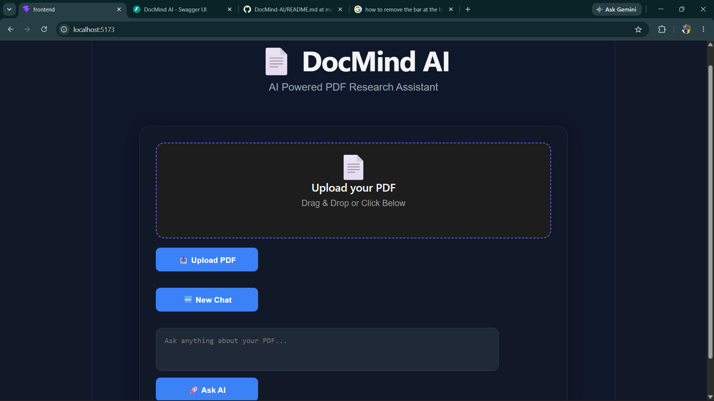
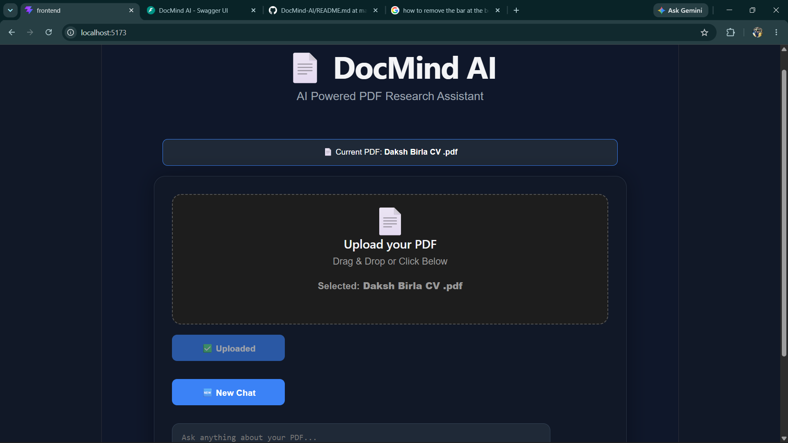
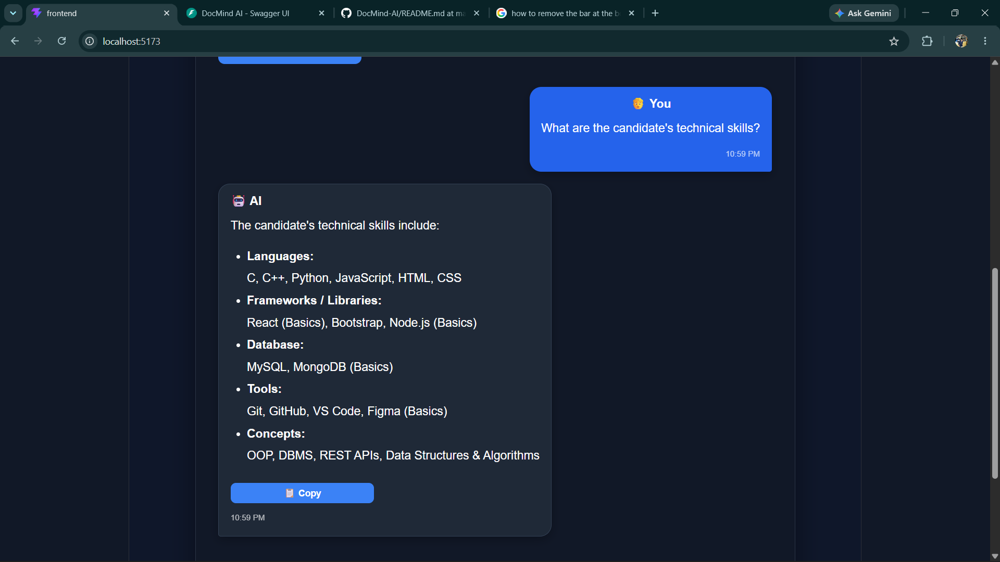

# 📄 DocMind AI

An AI-powered PDF Research Assistant that enables users to upload PDF documents, generate intelligent summaries, and ask context-aware questions using Retrieval-Augmented Generation (RAG), FAISS vector search, and Google Gemini.

---

## 🚀 Live Demo

🌐 **Frontend:** https://docmind-ai-daksh.vercel.app/

⚙️ **Backend API (Swagger):** https://docmind-ai-rqm9.onrender.com/docs

---

## ✨ Features

- 📄 Upload PDF documents
- ✂️ Automatic text extraction using PyMuPDF
- 🧩 Intelligent text chunking
- 🧠 Embedding generation
- 🔎 Semantic Search using FAISS Vector Database
- 🤖 AI-powered Question Answering using Google Gemini
- 📝 One-click PDF Summarization
- 💬 Interactive Chat Interface
- ⚡ FastAPI REST API
- 🌐 Fully deployed on Vercel & Render

---

## 🛠 Tech Stack

### Frontend
- React
- Vite
- Axios
- CSS

### Backend
- FastAPI
- Python
- FAISS
- Google Gemini API
- PyMuPDF

### Deployment
- Vercel
- Render

---

## 🏗️ Architecture

```text
PDF Upload
     │
     ▼
Text Extraction (PyMuPDF)
     │
     ▼
Text Chunking
     │
     ▼
Embeddings
     │
     ▼
FAISS Vector Store
     │
     ▼
Relevant Chunks
     │
     ▼
Google Gemini
     │
     ▼
Answer / Summary
```

---

## 📂 Project Structure

```
DocMind-AI
│
├── backend/
│   ├── main.py
│   ├── embedding.py
│   ├── vector_store.py
│   └── ...
│
├── frontend/
│   ├── src/
│   ├── components/
│   └── ...
│
├── screenshots/
│
├── requirements.txt
│
└── README.md
```

---

## ⚙️ Installation

### Clone Repository

```bash
git clone https://github.com/dakshbirla0710-stack/DocMind-AI.git
```

### Backend

```bash
cd backend
pip install -r ../requirements.txt
uvicorn main:app --reload
```

### Frontend

```bash
cd frontend
npm install
npm run dev
```

---

## 📸 Screenshots

### 🏠 Home Page



---

### 📄 Upload PDF



---

### 🤖 AI Chat



---

## 🚀 Future Improvements

- 📚 Multiple PDF support
- 👤 User Authentication
- 📜 Chat History
- 🌙 Dark Mode
- 📥 Export Chat as PDF
- ⚡ Streaming AI Responses

---

## 👨‍💻 Author

**Daksh Birla**

- GitHub: https://github.com/dakshbirla0710-stack
- LinkedIn: https://linkedin.com/in/dakshbirla

---

⭐ If you found this project useful, consider giving it a star!
